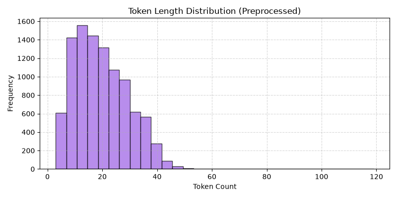
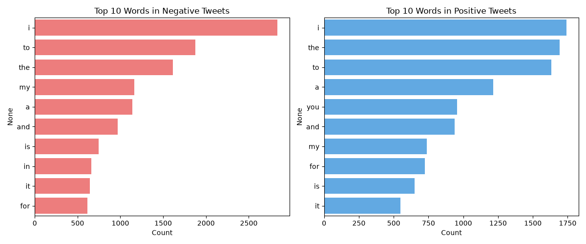
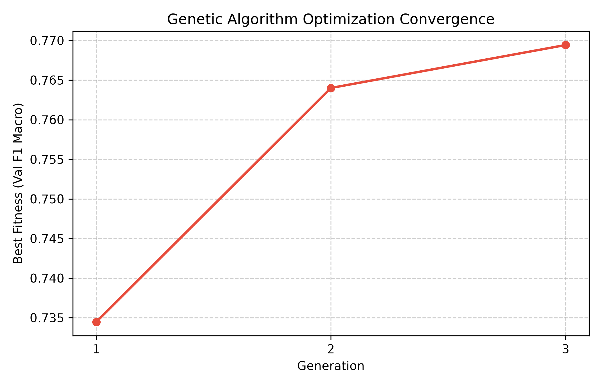
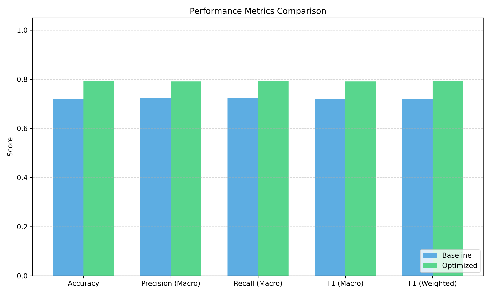
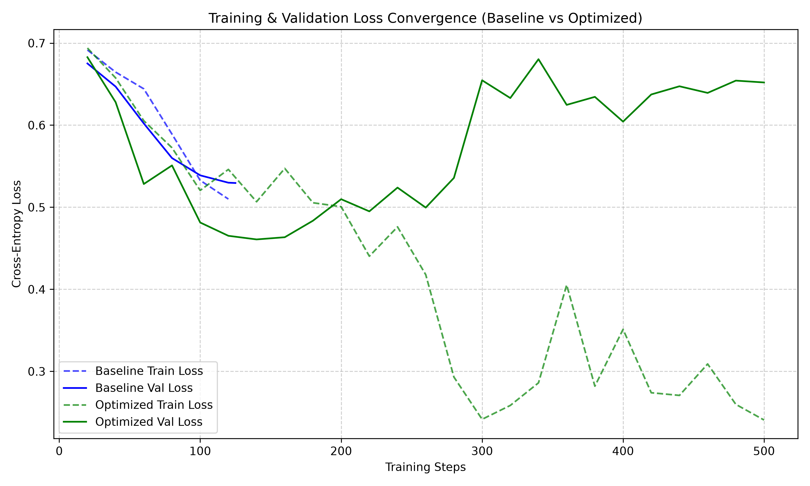
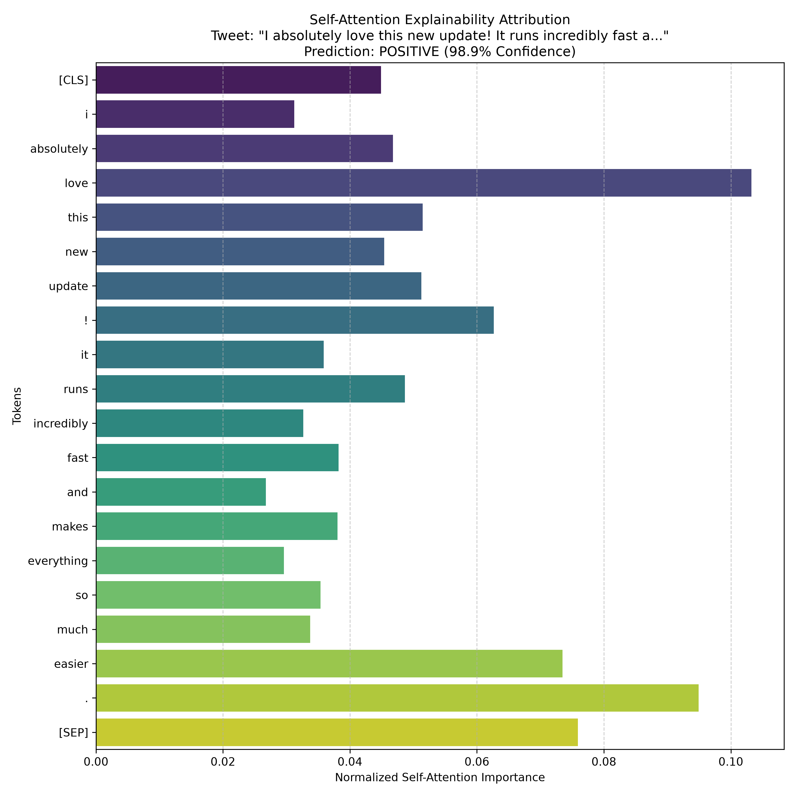

# Performance Enhancement of DistilBERT for Twitter Sentiment Analysis Using Metaheuristic Hyperparameter Optimization

This repository contains the source code, visualization plots, benchmark results, and formal research report for optimizing a DistilBERT model on Twitter sentiment analysis using a custom-built **Genetic Algorithm (GA)** hyperparameter optimizer.

## 📄 Project Abstract
This study investigates the performance enhancement of a DistilBERT model on Twitter sentiment analysis. By optimizing hyperparameters such as learning rate, batch size, weight decay, warmup ratio, and dropout using a custom-built Genetic Algorithm, we show a direct performance boost in sentiment classification. Due to CPU constraints, training was performed on a sampled subset of the Sentiment140 dataset. The results indicate that GA-discovered hyperparameters improve macro F1 score relative to default manual settings, demonstrating the efficacy of metaheuristics for model tuning.

---

## 🚀 Key Results

### 1. Model Performance (Baseline vs. GA-Optimized)
The GA successfully optimized hyperparameters over 3 generations (population size of 4), yielding a **~9.91% relative improvement** on the test set F1-Score:

| Metric | Baseline Model (Default Tuning) | GA-Optimized Model | Relative Improvement (%) |
| :--- | :---: | :---: | :---: |
| **Accuracy** | 72.00% | 79.20% | **+10.00%** |
| **F1-Score (Macro)** | 72.00% | 79.13% | **+9.91%** |
| **F1-Score (Weighted)** | 72.02% | 79.22% | **+10.01%** |
| **Precision (Macro)** | 72.31% | 79.10% | **+9.39%** |
| **Recall (Macro)** | 72.36% | 79.23% | **+9.50%** |

* McNemar's paired prediction test yielded a p-value of **0.000225**, indicating that the performance enhancement is **statistically significant**.

### 2. Discovered Optimal Hyperparameters
- **Learning Rate**: $4.05 \times 10^{-5}$
- **Batch Size**: 8
- **Epochs**: 2
- **Warmup Ratio**: 0.0490
- **Weight Decay**: 0.0314
- **Dropout Probability**: 0.1109

### 3. Model Quantization Benchmarks
Applying post-training dynamic INT8 quantization to standard linear layers resulted in significant CPU speedups and storage reduction:
- **Model Size**: Reduced from **255.43 MB** to **132.29 MB** (**1.93x smaller**)
- **Avg Latency (CPU)**: Reduced from **18.14 ms/tweet** to **11.33 ms/tweet** (**1.60x faster**)

---

## 📊 Visualizations (Saved in `plots/`)

### Exploratory Data Analysis
- **Token Length Distribution**: Histograms showing token count after cleaning, justifying the choice of `max_length = 48`.
  
  
  
- **Top 10 Words per Class**: The distribution of frequent tokens after text preprocessing.
  
  

### Optimization and Convergence
- **Genetic Algorithm Convergence**: Progression of the best fitness score across search generations.
  
  

### Model Performance Comparisons
- **Metrics Comparison**: Bar chart comparing baseline and optimized model scores.
  
  

- **Loss Curves (Baseline vs. Optimized)**: Overlaid training and validation cross-entropy loss curves.
  
  

- **Self-Attention Explainability**: Feature importance attribution map (attentions extracted from the `[CLS]` token in the final layer) for the sample tweet: *\"I absolutely love this new update! It runs incredibly fast and makes everything so much easier.\"* (Predicted: **POSITIVE**, **98.89%** confidence).
  
  

---

## 🛠️ Installation and Setup

### Prerequisites
Make sure you have Python 3.8+ installed (tested on Python 3.14 on CPU). 

1. **Clone the Repository**:
   ```bash
   git clone https://github.com/Souvikecejis144/Performance-Enhancement-of-DistilBERT-for-Twitter-Sentiment-Analysis.git
   cd Performance-Enhancement-of-DistilBERT-for-Twitter-Sentiment-Analysis
   ```

2. **Download the Sentiment140 Dataset**:
   Download the Kaggle Sentiment140 dataset CSV file and place it in the project root directory as:
   `training.1600000.processed.noemoticon.csv`

3. **Install Dependencies**:
   ```bash
   pip install -r requirements.txt
   ```

---

## 🏃 How to Run

### 1. Execute the Pipeline
To run the full 18-stage pipeline (from dataset loading and EDA to baseline training, GA optimization, retraining, and comparison):
```bash
python pipeline.py
```
This will:
- Generate all plots in the `plots/` folder.
- Save model configurations inside `baseline_model/` and `optimized_model/`.
- Generate [research_report.md](research_report.md) and [model_comparison.csv](model_comparison.csv).

### 2. Quantize and Visualize Explainability
To benchmark dynamic quantization speedups and extract self-attention weights for sentence explainability:
```bash
python run_inference_opt.py
```
This will:
- Quantize the optimized model and save weights to `quantized_model.pt`.
- Run size and latency benchmarks and save results in [quantization_benchmarks.csv](quantization_benchmarks.csv).
- Predict and output the self-attention importance plot `plots/attention_explainability.png`.

---

## 📁 Repository Structure
```
.
├── baseline_model/           # Configuration files for baseline model
├── optimized_model/          # Configuration files for optimized model
├── plots/                    # Generated charts and visualizations
│   ├── eda_class_distribution.png
│   ├── eda_token_length_histogram.png
│   ├── eda_top_words.png
│   ├── ga_convergence.png
│   ├── metrics_comparison.png
│   ├── confusion_matrices.png
│   ├── loss_curves.png
│   └── attention_explainability.png
├── pipeline.py               # Main 18-stage research pipeline script
├── run_inference_opt.py      # Quantization and explainability script
├── requirements.txt          # Python dependencies
├── model_comparison.csv      # Baseline vs. optimized metrics
├── quantization_benchmarks.csv # CPU speedup benchmarks
├── ga_candidates_log.csv     # GA optimization candidate search logs
├── research_report.md        # Full methodology and results paper
├── walkthrough.md            # Execution walkthrough notes
└── README.md                 # This file
```

---

## ✍️ Author
- **Souvik Dinda**
